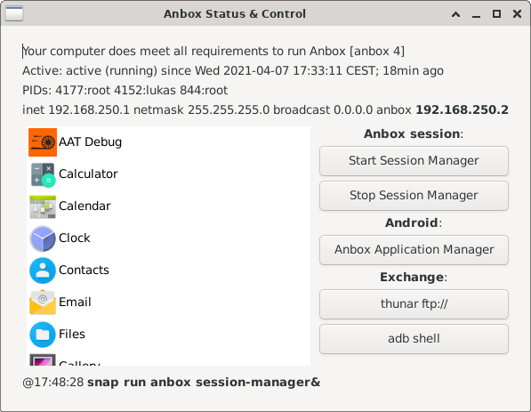

# Anbox Status & Control
GUI shell for [anbox](https://anbox.io/) written in perl.

## Features
- Display information about status of current installation
- List and start installed Android applications
- Start / stop session manager

## Dependencies
- [anbox](https://anbox.io/) installed with [snap](https://snapcraft.io/).
- perl 5
- libgtk3-perl

## Configuration
Adjust global variables at beginning of script

## Run
`perl ./anbox-status.pl`

## Screenshot

